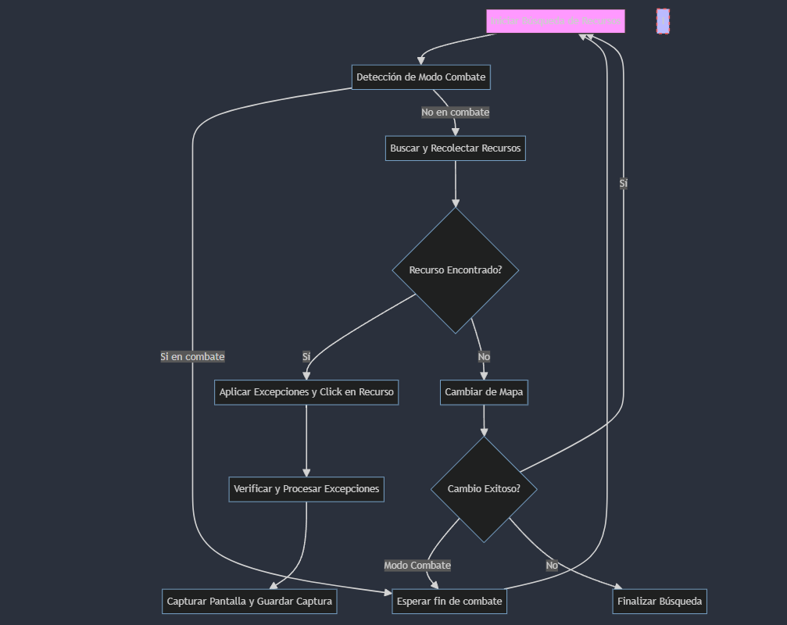

# SuperBot Project README

## Descripción del Proyecto
SuperBot es un bot automatizado diseñado para gestionar tareas en un entorno de juego simulado. Utiliza la detección de imágenes y la automatización de GUI para interactuar con el juego, recolectando recursos y manejando eventos dentro del juego como combates y cambios de mapa.

## Componentes del Proyecto
- `combat.py`: Gestiona la detección del modo de combate y espera hasta que finalice.
- `navigation.py`: Cambia la ubicación del bot en el mapa si es necesario.
- `resource_management.py`: Busca y recolecta recursos, aplicando excepciones específicas por tipo de recurso.
- `image_processing.py`: Captura y procesa imágenes para verificaciones de cambio de estado.
- `config.py`: Contiene todas las configuraciones globales, como rutas de imágenes, configuraciones de detección, y excepciones.

## Flujo de Trabajo del Bot
1. **Iniciar Búsqueda de Recursos**: Comienza el ciclo principal de búsqueda de recursos.
2. **Detección de Modo Combate**: Verifica si el bot está en modo combate.
   - Si está en combate, espera hasta que el combate termine y luego vuelve a iniciar la búsqueda.
   - Si no está en combate, procede a buscar y recolectar recursos.
3. **Buscar y Recolectar Recursos**: Intenta encontrar y recolectar recursos.
   - Si encuentra un recurso, verifica y aplica excepciones antes de realizar el clic.
   - Si no encuentra recursos, intenta cambiar de mapa.
4. **Cambiar de Mapa**: Si es necesario, cambia la ubicación en el mapa.
   - Verifica si el cambio fue exitoso y si no está en combate para decidir los próximos pasos.
   - Si el cambio no fue exitoso o entra en modo combate, termina la búsqueda o maneja el evento de combate.
5. **Capturar Pantalla y Guardar Captura**: Opcionalmente captura la pantalla después de cada acción significativa para registro y verificación.

## Instalación y Configuración
Asegúrate de tener Python instalado y configura las dependencias como PyAutoGUI y Pillow siguiendo estos pasos:
```bash
pip install pyautogui pillow pytesseract
